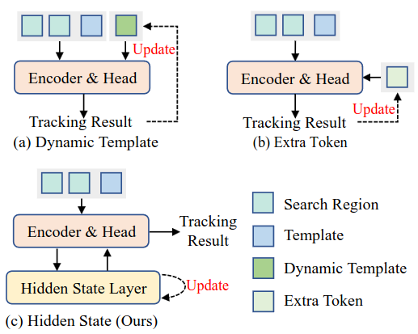
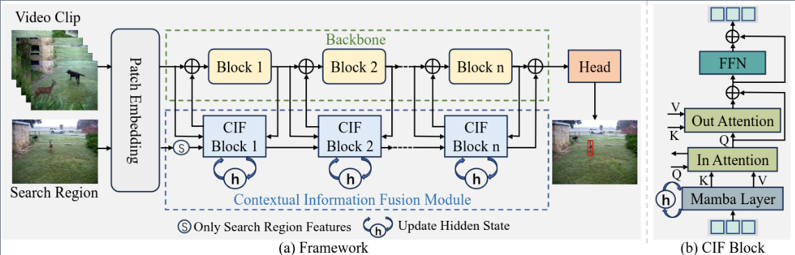

# MCITrack
* # [AAAI'2025] - Exploring Enhanced Contextual Information for Video-Level Object Tracking
> [**Exploring Enhanced Contextual Information for Video-Level Object Tracking**]()<br>
[Ben Kang](https://scholar.google.com.hk/citations?user=By9F6bwAAAAJ), [Xin Chen](https://scholar.google.com.hk/citations?user=A04HWTIAAAAJ), [Simiao Lai](https://scholar.google.com/citations?user=_It52jkAAAAJ&hl=zh-CN&oi=ao), [Yang Liu](https://faculty.dlut.edu.cn/liuyang1/zh_CN/index.htm), [Yi Liu](https://www.owenliu.net/), [Dong Wang](http://faculty.dlut.edu.cn/wangdongice/zh_CN/index.htm)

[[Models](https://drive.google.com/drive/folders/1x6hTaBpF8dO_G8TsBn9z-or7FtKBF1mb?usp=sharing)] , [[raw_results](https://drive.google.com/file/d/1zgCks9KNd0iVFrKtOvXrcxTKM4CfEok7/view?usp=sharing)], [[training_logs](https://drive.google.com/file/d/178JHRHi1JaNg-0yGehkcSBgzwpufMGSJ/view?usp=sharing)]

This is an official pytorch implementation of the paper Exploring Enhanced Contextual Information for Video-Level Object Tracking.


## Highlights
### New contextual information propagation method
MCITrack utilizes hidden states to efficiently transmit richer and more significant contextual information.



### Simple architecture 
MCITrack has a simple structure, consisting of a backbone, a contextual information fusion module, and a prediction head.




### Strong performance
#### Comparsion with SOTA Models:
| Tracker           | LaSOT (AUC) | LaSOT_ext (AUC) | TrackingNet (AUC) | GOT10K (A0) | 
|-------------------|-------------|-----------------|-------------------|-------------|
| **MCITrack-B224** | **75.3**    | **54.6**        | **86.3**          | **77.9**    |
| ODTrack-B384      | 73.2        | 52.4            | 85.1              | 77.0        | 
| ARTrackV2-256     | 71.6        | 50.8            | 84.9              | 75.9        | 
| LoRAT-B224        | 71.7        | 50.3            | 83.5              | 72.1        |

#### Large-Scale Comparsion:
| Tracker           | LaSOT (AUC) | LaSOT_ext (AUC) | TrackingNet (AUC) | GOT10K (A0) | 
|-------------------|-------------|-----------------|-------------------|-------------|
| **MCITrack-L384** | **76.6**    | **55.7**        | **87.9**          | **80.0**    |
| ODTrack-L384      | 74.0        | 53.9            | 86.1              | 78.2        | 
| ARTrackV2-L384    | 73.6        | 53.4            | 86.1              | 79.5        | 
| LoRAT-L378        | 75.1        | 56.6            | 85.6              | 77.5        |

## Install the environment
```
conda create -n mcitrack python=3.11
conda activate mcitrack
bash install.sh
```

* Add the project path to environment variables
```
export PYTHONPATH=<absolute_path_of_MCITrack>:$PYTHONPATH
```

## Data Preparation
Put the tracking datasets in [./data](data). It should look like:

   ```
   ${MCITrack_ROOT}
    -- data
        -- lasot
            |-- airplane
            |-- basketball
            |-- bear
            ...
        -- got10k
            |-- test
            |-- train
            |-- val
        -- coco
            |-- annotations
            |-- images
        -- trackingnet
            |-- TRAIN_0
            |-- TRAIN_1
            ...
            |-- TRAIN_11
            |-- TEST
        -- vasttrack
            |-- Zither
            |-- Zebra
            ...
   ```

## Set project paths
Run the following command to set paths for this project
```
python tracking/create_default_local_file.py --workspace_dir . --data_dir ./data --save_dir .
```
After running this command, you can also modify paths by editing these two files
```
lib/train/admin/local.py  # paths about training
lib/test/evaluation/local.py  # paths about testing
```

## Train
Download [pre-trained weights](https://drive.google.com/drive/folders/1qDAMcU3JpahV7MriEOl4KfjKvAAFXd3E?usp=sharing) and put it under [./pretrained](pretrained)
### Train MCITrack
```
torchrun --nproc_per_node 8 lib/train/run_training.py --script mcitrack --config mcitrack_b224 --save_dir .
```


## Test and evaluate on benchmarks
Put the downloaded checkpoints under [./checkpoints/train/mcitrack](/checkpoints)
- LaSOT
```
python tracking/test.py mcitrack mcitrack_b224 --dataset lasot --threads 2
python tracking/analysis_results.py # need to modify tracker configs and names
```
- LaSOT_ext
```
python tracking/test.py mcitrack mcitrack_b224 --dataset lasot_extension_subset --threads 2
python tracking/analysis_results.py # need to modify tracker configs and names
```

- GOT10K-test
```
python tracking/test.py mcitrack mcitrack_b224_got --dataset got10k_test --threads 2
python lib/test/utils/transform_got10k.py --tracker_name mcitrack --cfg_name mcitrack_b224_got
```
- TrackingNet
```
python tracking/test.py mcitrack mcitrack_b224 --dataset trackingnet --threads 2
python lib/test/utils/transform_trackingnet.py --tracker_name mcitrack --cfg_name mcitrack_b224
```
- TNL2K
```
python tracking/test.py mcitrack mcitrack_b224 --dataset tnl2k --threads 2
python tracking/analysis_results.py # need to modify tracker configs and names
```
- UAV123
```
python tracking/test.py mcitrack mcitrack_b224 --dataset uav --threads 2
python tracking/analysis_results.py # need to modify tracker configs and names
```
- NFS
```
python tracking/test.py mcitrack mcitrack_b224 --dataset nfs --threads 2
python tracking/analysis_results.py # need to modify tracker configs and names
```

## Test FLOPs, Params and Speed
```
python tracking/profile_model.py --script mcitrack --config mcitrack_b224
```

## Citation
```
@inproceedings{kang2025exploring,
  title={Exploring Enhanced Contextual Information for Video-Level Object Tracking}, 
  author={Ben Kang and Xin Chen and Simiao Lai and Yang Liu and Yi Liu and Dong Wang},
  booktitle={AAAI},
  year={2025}
}
```


## Contact
* Ben Kang (email:kangben@mail.dlut.edu.cn)


